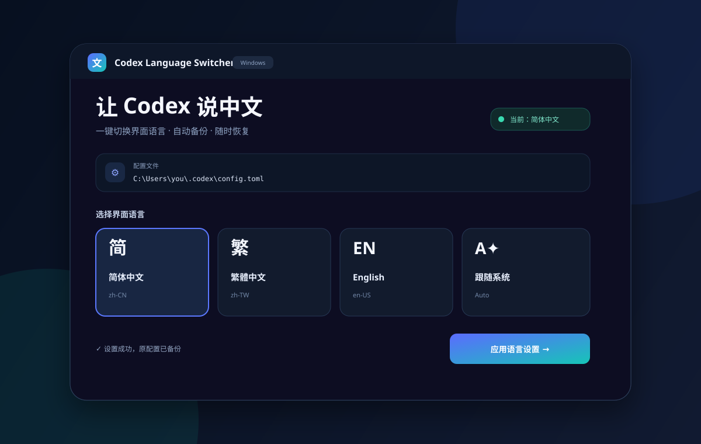

# Codex Language Switcher

一个无需安装依赖、带现代化图形界面的 Windows Codex 语言切换器。



## 功能

- 一键切换 **简体中文 / 繁體中文 / English / 跟随系统**
- 自动识别 `%USERPROFILE%\.codex\config.toml`
- 每次修改前自动备份，支持一键恢复
- 原子写入配置，降低配置文件损坏风险
- 深色现代 UI，不依赖 Electron、Python 或第三方组件
- 兼容 Windows PowerShell 5.1 与 PowerShell 7

## 使用方法

1. 下载仓库，双击 **`Start-Codex-Language-Switcher.cmd`**。
2. 选择“简体中文”。
3. 点击“应用语言设置”。
4. 完全退出 Codex，再重新打开。

也可以直接运行：

```powershell
powershell.exe -NoProfile -ExecutionPolicy Bypass -STA -File .\Codex-Language-Switcher.ps1
```

## 工作原理

工具只会修改 Codex 用户配置中的桌面语言项：

```toml
[desktop]
localeOverride = "zh-CN"
```

备份保存在：

```text
%USERPROFILE%\.codex\language-switcher-backups\
```

选择“跟随系统”时，会移除 `localeOverride`，让 Codex 自动检测系统语言。

## 测试

```powershell
powershell.exe -NoProfile -File .\tests\Test-Core.ps1
powershell.exe -NoProfile -File .\tests\Test-Ui.ps1
```

## 说明

本项目为社区工具，与 OpenAI 无隶属或官方合作关系。Codex 与 OpenAI 是其各自权利人的商标。

## License

[MIT](LICENSE)
